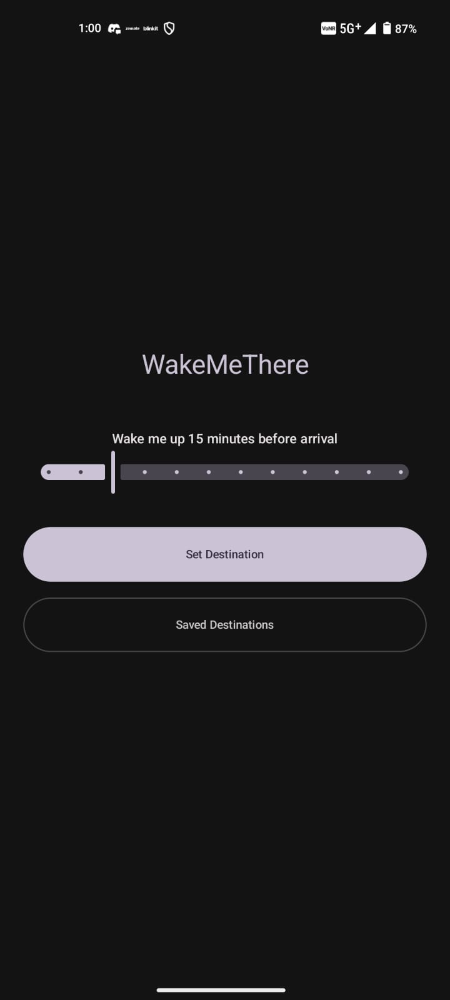
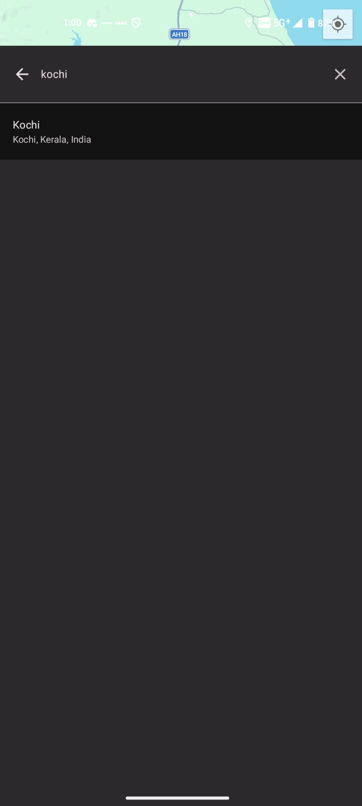
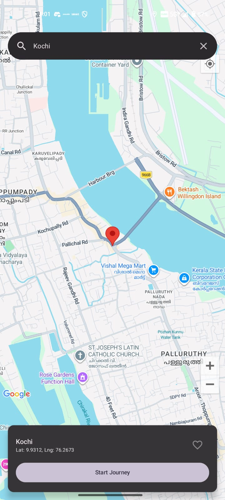
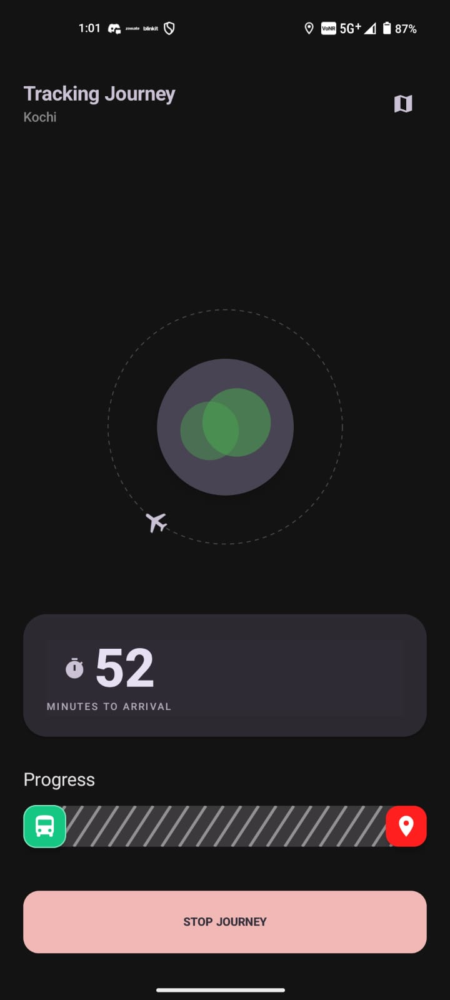

# WakeMeThere 

**WakeMeThere** is a modern Android travel assistant designed to ensure you never miss your stop again. Whether you're on a bus, train, or car, the app tracks your journey in real-time and triggers a loud alarm before you reach your destination.

## 🚀 Features

- **Open-Source Map Integration**: Uses **MapLibre GL** for high-performance, open-source vector maps. Select your destination directly on the map or use the integrated search.
- **Privacy-First Search**: Destination search powered by Android's native **Geocoder** (no external API keys required for basic search).
- **Smart Alarm Threshold**: Set how many minutes (5-60) before arrival you want to be woken up.
- **Background Tracking**: Uses a Foreground Service to keep tracking your location reliably even when your phone is locked or the app is minimized.
- **Advanced Animations**:
    - **Rotating Globe**: A premium procedural globe animation during tracking.
    - **Uber-Style Progress**: A custom striped loading bar with a moving vector bus icon that fills as you approach your stop.
- **Saved Destinations**: Store your favorite or frequent locations in a local Room database for quick access.
- **Live Journey Map**: Expand the map during your trip to see your real-time position along the shortest road-based route powered by **OSRM**.

## 📸 App Gallery

| Home Screen | Smart Search | Destination Selected |
| :---: | :---: | :---: |
|  |  |  |

| Journey Dashboard |
| :---: |
|  |

## 📥 Getting Started

### For Users
Simply go to the **[Releases](https://github.com/[YOUR_USERNAME]/WakeMeThere/releases)** section of this repository and download the latest `.apk` file. 
- This version is **ready to use** and requires no technical setup or API keys.
- You may need to "Allow installation from unknown sources" on your Android device to install the APK.

### For Developers
If you are cloning the source code to build or modify the project:
1. Open the project in **Android Studio**.
2. Sync project with Gradle and run.

## 🛠️ Technical Stack

- **UI**: Jetpack Compose (Material 3)
- **Maps**: [MapLibre GL Android SDK](https://maplibre.org/maplibre-gl-native/)
- **Search**: Android `Geocoder` (OpenStreetMap compatible)
- **Routing**: [OSRM (Open Source Routing Machine)](https://project-osrm.org/)
- **Database**: Room Persistence Library with KSP
- **Architecture**: MVVM with ViewModel and StateFlow
- **Service**: Android Foreground Service for persistent tracking

## 📦 How to Build

1. Clone the repository.
2. Open in Android Studio.
3. Sync project with Gradle.
4. Run `./gradlew assembleDebug` for a test build or `./gradlew assembleRelease` for the final optimized APK.
